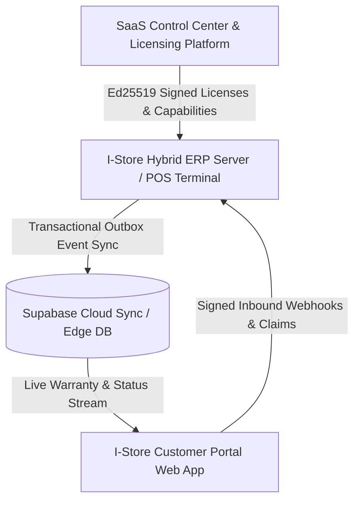

# E-Store / I-Store Ecosystem Architecture & Production Deployment Runbook

## 1. System Overview & Platform Topology

The E-Store / I-Store platform is an enterprise-grade, multi-tenant retail and repair ERP ecosystem structured into 3 distinct, decoupled repositories:



### Repositories
1. **`E Store Bussiness and License Platform`**:
   - **Role**: Central Multi-Tenant Governance, SaaS Plan Management, Industry Capability Templates, and Ed25519 Cryptographic License Authority.
2. **`I Store Website`**:
   - **Role**: Core Retail & Repair ERP Engine, POS Checkout, IMEI & Warranty Management, Transactional Outbox Engine, Inbound Gateway, and Offline-First Local Storage.
3. **`I-Store-Customer-Portal`**:
   - **Role**: Public and Authenticated Customer Self-Service Portal (Interactive Digital Invoices, Live 6-Stage Repair Progress Tracker, QR Warranty Certificates, Claims Submissions, VIP Loyalty & Trade-In Estimator).

---

## 2. Security & Cryptographic Architecture

### A. Central Ed25519 Licensing & Offline Grace Periods
- **Algorithm**: Asymmetric Ed25519 (Elliptic Curve 25519, 256-bit security).
- **Format**: Deterministically canonicalized JSON (`sort_keys=True`, `,:` separators) signed with the private key on the Control Center.
- **Verification**: Verified locally on ERP terminals against the trusted public keyring (`ESTORE_PUBLIC_KEY_B64`).
- **Machine Binding**: Locked to hardware UUID / machine fingerprint to prevent unauthorized redistribution.
- **Grace Period**: 72-hour offline operation grace period if the Control Center cannot be reached.

### B. Dual-Mode Customer Authentication Adapter
- **Mode 1 (Public Smart Token)**: Digital invoice receipts and warranty QR codes include a HMAC-SHA256 signature token (`sec_token`) in the URL, granting view access without requiring login.
- **Mode 2 (Authenticated Vault)**: Customers enter their phone number and receive a 6-digit verification code via WhatsApp (0 SMS cost) or pluggable SMS gateway. Verification returns an HMAC-SHA256 authenticated customer session token.

---

## 3. Data Synchronization & Resilience Architecture

### A. Transactional Outbox Pattern
- All POS checkouts and repair intakes write business entities (`Sale`, `WarrantyRecord`, `RepairTicket`) and their sync events (`SyncOutbox`) inside the **same database transaction**.
- A background worker (`supabase_pos_sync.py`) polls pending events, dispatches them to Supabase cloud, and marks them `synced`.
- Features **exponential backoff retry** (up to 5 retries) and moves unresolvable records to a **Dead-Letter Queue (DLQ)** with audit alerts.

### B. ERP Inbound Gateway
- Validates external customer claims and repair appointment bookings from the customer portal.
- Guaranteed **idempotent execution**: Duplicate webhooks with the same `claim_id` or `booking_id` are safely acknowledged without creating duplicate ERP records.

---

## 4. Multi-Industry Capability Engine

The platform dynamically adjusts UI navigation, POS workflow, and API permissions based on the active industry template:

| Industry Template | Code | Key Capabilities Enabled |
| :--- | :--- | :--- |
| **Mobile Retail & Repairs** | `MOBILE_RETAIL` | IMEI tracking, Device intake, Repair tickets, Warranty management, Trade-ins |
| **Supermarket & Grocery** | `GROCERY` | Batch tracking, Expiry date management, Weighted scales, Decimal quantities |
| **Fashion & Apparel** | `FASHION` | Size/Color matrix, Seasonal discounts, Barcode scanning |
| **Consumer Electronics** | `ELECTRONICS` | Serial number tracking, Warranty management, Repair center |
| **Cosmetics & Beauty** | `COSMETICS` | Batch tracking, Expiration alerts, Ingredient search |
| **General Retail POS** | `GENERAL_RETAIL` | Standard inventory, Fast-key POS, Multi-payment methods |

---

## 5. Production Deployment Runbook

### Step 1: Control Center Setup
1. Copy `.env.production.example` to `.env` in `E Store Bussiness and License Platform/backend`.
2. Generate Ed25519 Root Keypair and set `LICENSE_PRIVATE_KEY_B64` and `LICENSE_PUBLIC_KEY_B64`.
3. Run Alembic migrations: `alembic upgrade head`.
4. Build frontend: `cd frontend && npm install && npm run build`.

### Step 2: ERP Backend Setup
1. Copy `.env.production.example` to `.env` in `I Store Website/backend`.
2. Paste the matching `ESTORE_PUBLIC_KEY_B64` from Control Center.
3. Configure `PORTAL_AUTH_SECRET` and `DATABASE_URL`.
4. Start ERP server: `uvicorn app.main:app --host 0.0.0.0 --port 8000`.

### Step 3: Customer Portal Setup
1. Copy `.env.production.example` to `.env` in `I-Store-Customer-Portal`.
2. Configure `VITE_SUPABASE_URL`, `VITE_SUPABASE_ANON_KEY`, and `VITE_ERP_API_BASE_URL`.
3. Build production bundle: `npm install && npm run build`.
4. Deploy `dist/` to Cloudflare Pages, Vercel, Netlify, or Nginx.

### Step 4: Run Automated Ecosystem Diagnostic Check
```powershell
python scripts/ecosystem_health_check.py
```
