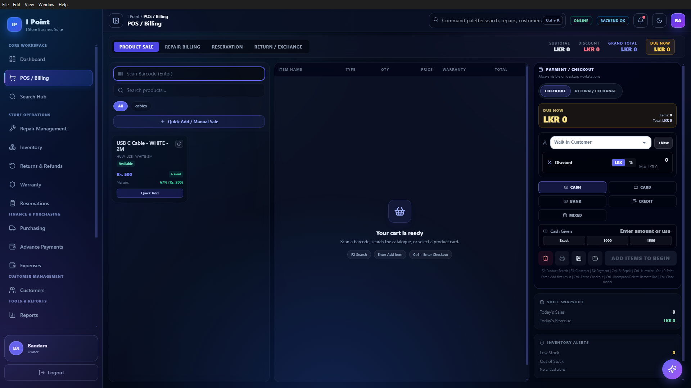
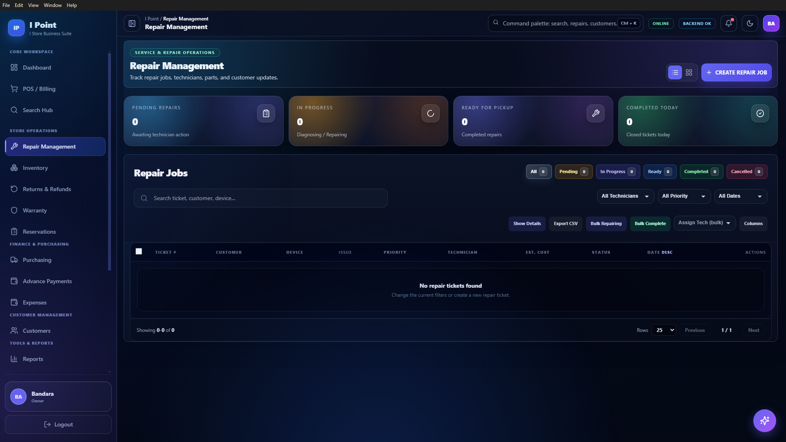
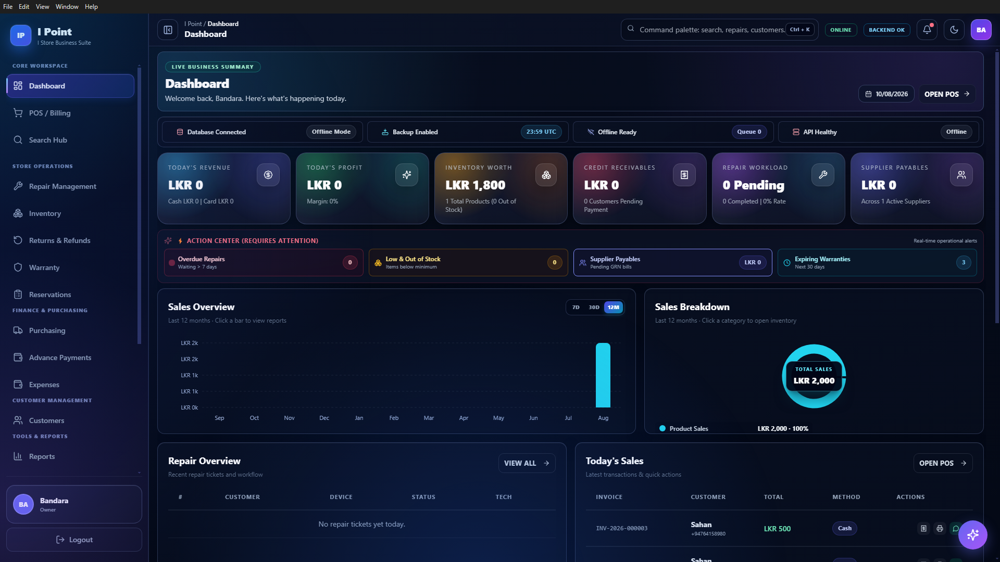
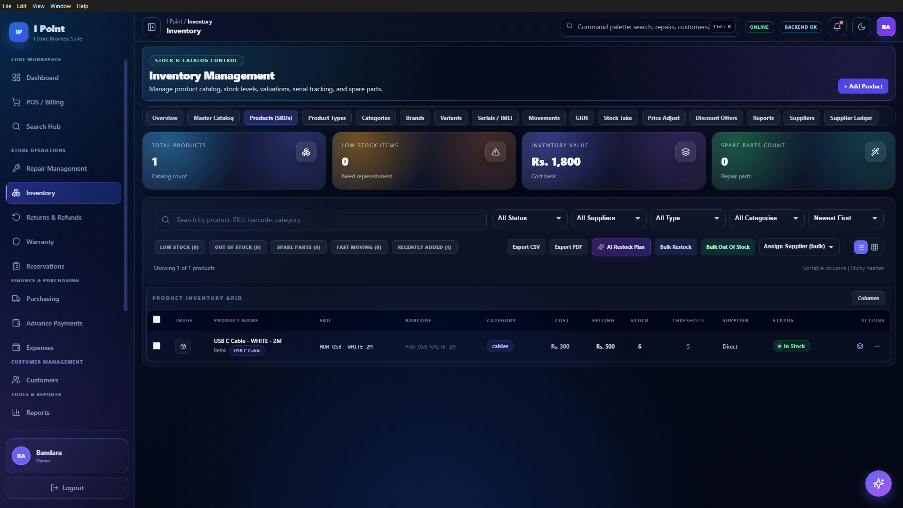
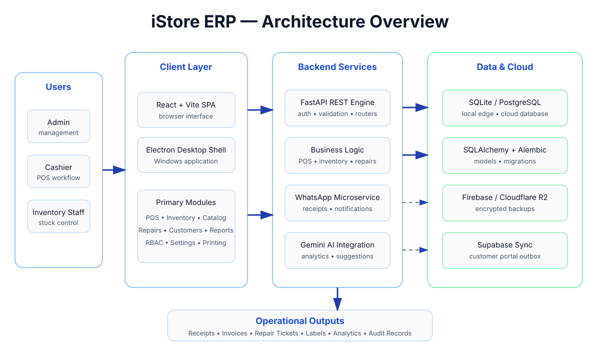

# iStore ERP — Retail POS, Inventory & Repair Management System

[](https://fastapi.tiangolo.com)
[](https://reactjs.org)
[](https://vitejs.dev)
[](https://www.electronjs.org/)
[](https://www.postgresql.org)
[](https://github.com/SahanPramuditha-Dev/I-Store-Website/actions/workflows/ci.yml)
[](LICENSE)

A production-grade, all-in-one ERP system tailored for electronics stores, mobile repair shops, and modern retail businesses. Built with high performance in mind, **iStore ERP** runs seamlessly as a standalone **Windows desktop app (Electron)**, a **local networked POS**, or a **cloud-hosted web platform (Vercel + Neon PostgreSQL)**.

---

## 📸 Visual Showcase

### Featured Workflows

| POS & Quick Billing | Repair & Ticket Workflow |
| :---: | :---: |
|  |  |

| Dashboard & Real-Time Analytics | Inventory & Low-Stock Alerts |
| :---: | :---: |
|  |  |

<details>
<summary><b>🔍 Expand Full Screenshot Gallery</b></summary>

#### Core Features
- [📊 Dashboard Overview](Screenshots/dashboard-overview.png)
- [💳 POS Billing & Split Checkout](Screenshots/pos-billing.png)
- [🛠️ Repair Service Management](Screenshots/repair-management.png)
- [📱 Repair Public Tracking](Screenshots/repair-tracking.png)
- [📦 Inventory & Batch Control](Screenshots/inventory-management.png)
- [🔄 Returns, Exchanges & Refunds](Screenshots/returns-and-refunds.png)
- [🛡️ Warranty Center](Screenshots/warranty-dashboard.png)
- [📑 Reservations & Customer Orders](Screenshots/reservations-orders.png)
- [📈 Reports & Revenue Analytics](Screenshots/reports-analytics.png)
- [🖨️ Thermal Label & Receipt Print Center](Screenshots/print-center.png)

#### Administration & Security
- [🔄 Auto Updates & Versioning](Screenshots/software-update.png)
- [☁️ Cloud & Local Backup Management](Screenshots/secure-cloud-backups.png)
- [👥 Role-Based Access Control (RBAC)](Screenshots/role-based-access-control.png)
- [🔐 Fine-Grained Permissions Matrix](Screenshots/permissions-management.png)
- [📝 Security Audit Trail](Screenshots/audit-trail.png)
- [🔔 Notification Center](Screenshots/notifications-center.png)
- [💾 Backup Center & Snapshots](Screenshots/backup-center.png)
- [⚙️ System Configuration Settings](Screenshots/settings-system-configuration.png)

</details>

---

## 🚀 Key Features & Modules

### 1. 💳 Point of Sale (POS)
- Lightning-fast barcode scanning and product search.
- Split payments across Cash, Credit/Debit Card, and Bank Transfer.
- Customer loyalty points, immediate discounts, and quotation conversion.
- Cashier shift management with cash float tracking, drawer verification, and day-end closing reconciliation.

### 2. 📦 Inventory & Stock Control
- Real-time stock level tracking with automated low-stock warnings.
- Batch tracking, IMEI/Serial number logging, and expiry date management.
- Multi-category organization and stock movement audit logs.

### 3. 🛠️ Repair & Workshop Service Management
- End-to-end device repair workflow: *Received → Diagnosing → Pending Parts → Completed → Delivered*.
- Job sheet generation with issue diagnostics, customer signature capture, and technician assignments.
- Customer self-service public status tracking link with QR code.

### 4. 🤖 WhatsApp Bot & Automated Notifications
- Embedded Node.js WhatsApp microservice for instant digital receipt delivery.
- Automated repair status milestone updates sent straight to customer WhatsApp.
- Scheduled daily sales, cashier performance, and inventory health reports broadcast to store owners.

### 5. 🧠 Google Gemini AI Retail Assistant
- Natural language store queries (*e.g., "What were our top 3 profit items this week?"*).
- Intelligent re-ordering and stock replenishment suggestions based on sales velocity.

### 6. 🖨️ Thermal Printing & Barcode Generator
- Formatted thermal receipts (80mm & 58mm POS standards).
- Custom thermal barcode and price sticker printing engine with live preview.

### 7. 🛡️ Role-Based Access Control (RBAC) & Audit Logs
- Granular permissions for *Admin*, *Manager*, *Cashier*, and *Technician*.
- Tamper-evident activity logs capturing sensitive actions (price overrides, voids, manual stock adjustments).

### 8. ☁️ Disaster Recovery & Hybrid Sync
- Offline-first desktop operations with SQLite local persistence.
- Automatic encrypted cloud snapshots (Firebase Storage / Cloudflare R2).
- Real-time outbox synchronization to Cloud Customer Portal via Supabase.

---

## 🏗️ Architecture & Technology Stack



The system separates browser/desktop clients, FastAPI business services, local/cloud persistence, messaging/AI integrations, and operational outputs. This keeps POS-critical workflows usable locally while supporting cloud sync, backups, notifications, and customer-facing services.

- **Frontend**: React 18, Vite, Lucide Icons, Custom Design System (Vanilla CSS).
- **Backend API**: Python 3.10+, FastAPI, SQLAlchemy, Pydantic, Alembic, Uvicorn.
- **Desktop Shell**: Electron, electron-updater, PyInstaller binary wrapper.
- **Microservices**: Node.js WhatsApp bot (`whatsapp-web.js` / Puppeteer).
- **Databases**: SQLite (Desktop / Edge) & PostgreSQL (Cloud / Neon.tech).
- **Cloud & AI**: Google Gemini 1.5, Firebase Storage / Cloudflare R2, Supabase Sync.

For a deeper technical view, see [`docs/ARCHITECTURE.md`](docs/ARCHITECTURE.md).

---

## ⚡ Getting Started

### Prerequisites
- **Node.js** (v18 or higher) & **npm**
- **Python** (v3.10 or higher)
- **Git**

### Quickstart (All-in-One Dev Launch)

Clone the repository and run the startup script:

```powershell
# 1. Clone repo
git clone https://github.com/SahanPramuditha-Dev/I-Store-Website.git
cd I-Store-Website

# 2. Copy environment variables
copy .env.example .env

# 3. Launch dev environment (Backend + Frontend + Services)
.\start_dev.ps1
```

---

### Manual Step-by-Step Setup

#### 1. Backend Service
```bash
cd backend
python -m venv .venv

# Windows
.venv\Scripts\activate
# Linux/macOS
source .venv/bin/activate

pip install -r requirements.txt
uvicorn app.main:app --reload --port 8000
```
API Documentation will be available at: [http://127.0.0.1:8000/docs](http://127.0.0.1:8000/docs)

#### 2. Frontend Web App
```bash
cd frontend
npm install
npm run dev
```
Web application will be accessible at: [http://localhost:5173](http://localhost:5173)

#### 3. WhatsApp Microservice (Optional)
```bash
cd whatsapp_service
npm install
npm start
```

---

## 🐳 Docker Deployment

To launch the full backend and PostgreSQL database with Docker:

```bash
docker-compose up -d --build
```

---

## 📚 Documentation Directory

Explore dedicated guides located in the [`docs/`](docs/) directory:

| Document | Description |
| :--- | :--- |
| 🚀 [**Deployment Guide**](docs/DEPLOYMENT.md) | Windows Desktop packaging, Docker, and Vercel/Neon deployment. |
| 🏗️ [**Architecture Overview**](docs/ARCHITECTURE.md) | Technical architecture, data flow, and IPC bridge specifications. |
| 🔌 [**API Specification**](docs/API.md) | Comprehensive REST API endpoints and data models. |
| 🗄️ [**Database Guide**](docs/DATABASE.md) | Schemas, relationship diagrams, and Alembic migrations. |
| 🔄 [**Auto Update Mechanism**](docs/AUTO_UPDATE.md) | Electron desktop background update flow and release channels. |
| 💾 [**Backup & Recovery**](docs/BACKUP_RESTORE.md) | Local snapshots, R2/Firebase cloud backups, and restore operations. |
| 🚨 [**Disaster Recovery Guide**](docs/RECOVERY_GUIDE.md) | Step-by-step emergency database recovery and integrity checks. |
| 🔒 [**Security Guide**](docs/SECURITY.md) | JWT auth, RBAC permissions matrix, encryption, and API policies. |
| 🧪 [**Testing Guide**](docs/TESTING.md) | Running backend pytest suites and frontend build checks. |
| 🤖 [**WhatsApp Integration**](docs/WHATSAPP_INTEGRATION_SPEC.md) | Node.js WhatsApp microservice and webhook specifications. |
| 📋 [**Release Checklist**](docs/RELEASE_CHECKLIST.md) | Pre-flight production checks and release verification steps. |
| 🔍 [**Production Readiness Audit**](docs/PRODUCTION_READINESS_AUDIT.md) | Comprehensive audit of system reliability, performance, and security. |

---

## 🤝 Contributing

Contributions make the open-source community an amazing place to learn, inspire, and create.
Please review our [Contributing Guide](CONTRIBUTING.md) and [Changelog](CHANGELOG.md) before submitting Pull Requests.

---

## 📄 License

Distributed under the MIT License. See [LICENSE](LICENSE) for details.
